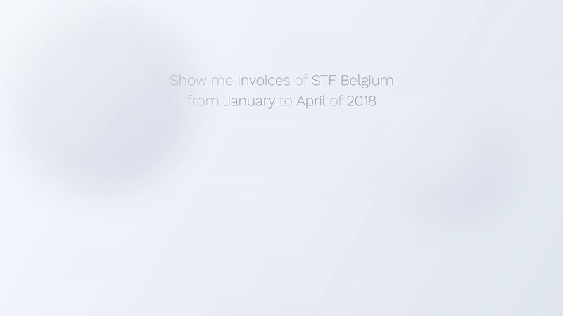
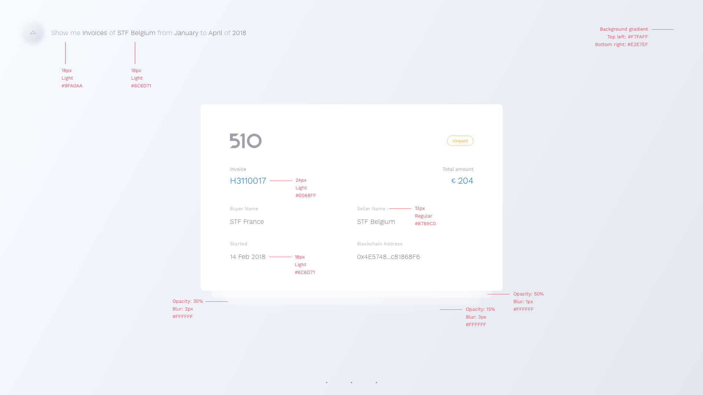

# Front-End Skill Test
What we expect from this test:

- The complete flow from the loading screen to the invoice listing (cards) until able to open one single invoice;
- Navigation between invoices (up and down);
- Details of a single, opened invoice (hide three invoices behind the opened one);
- Be able to navigate (horizontally) through the opened invoice;
- Be able to go back to the invoice listing;
- Transitions and animations through the navigation based on the actions you take;
- Preferable built with [Vue.js](https://cli.vuejs.org/ "Vue CLI");

This is what your deliverable should look like:

Some considerations
- Job description can be found in **frontend-profile.pdf**;
- You can fork this repository and publish your solution there, just make sure you make it private to prevent other candidates from peeking on your work;
- We will only accept a hosted solution accessible via a publicly available url. The easiest way to host your solution would be on GitHub Pages; If you choose to build it with Vue you have a step by step guide on how to do it [here](https://medium.com/@Roli_Dori/deploy-vue-cli-3-project-to-github-pages-ebeda0705fbd "Host Vue app on GitHub pages");
- Assets for the test can be found in the assets folder; 
- The font family used in the design is **Work Sans** (https://fonts.google.com/specimen/Work+Sans);
- Below is the specification for some of the design elements:

That's all! 

We wish you the best of lucks and look forward to see what you are capable of.
