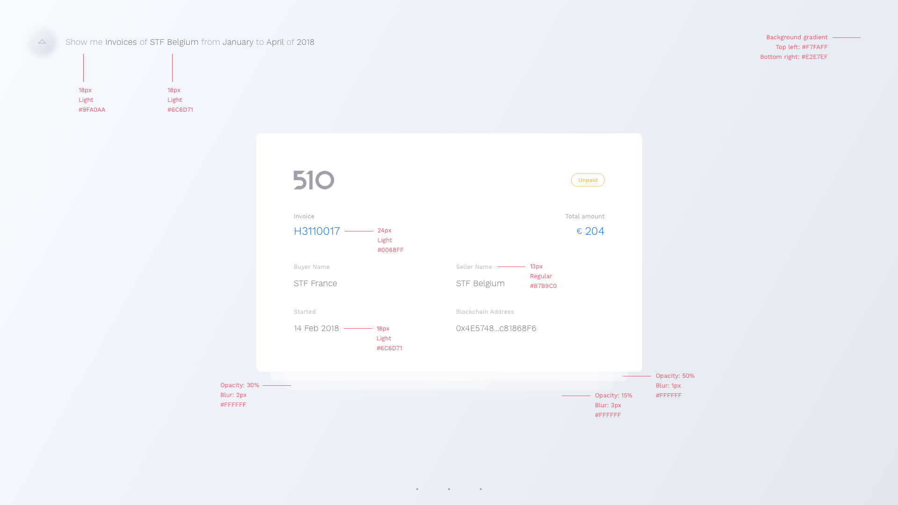

# Front-End Skill Test
What we expect from this test:

- The complete flow from the loading screen to the invoice listing (cards) until be able to open one single invoice;
- Navigation between invoices (up and down);
- Details of a single, opened invoice (hide three invoices behind the opened one);
- Be able to navigate (horizontally) through the opened invoice;
- Be able to go back to the invoice listing;
- Transitions and animations through the navigation based on the actions you take;
- Preferable built with Vue.js;

Assets: Can be found in the assets folder
Video: [link_for_the_video]
Font used: Work Sans - https://fonts.google.com/specimen/Work+Sans

